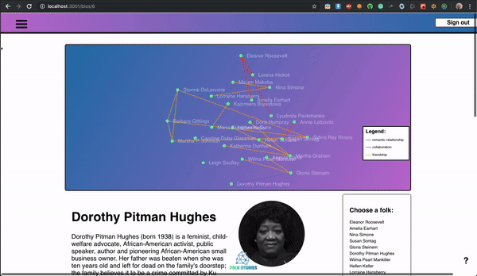
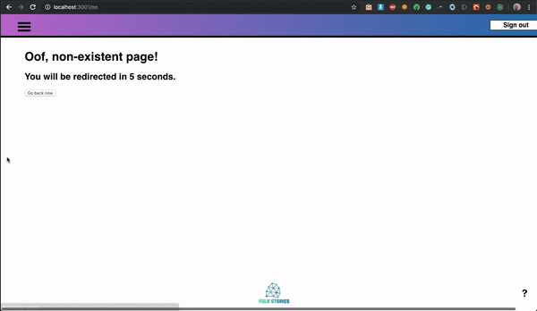

## FOLK STORIES - project description
Folk Stories offers a daily dose of empowerment in the form of stories, bios and places connected to the histories that did not make it to the school text books such as queer and women’s history. 

Explore: [Backend repo] (https://github.com/sylwiavargas/Folk-Stories-API)

### Snapshots

Events page:

D3 visualization of connections + nested components/routes:

Google API, geolocalization, stroll calculation:

Spring animation:

### Tech used:
- React+Redux front-end,
- Ruby on Rails back-end,
- Postgres database,
- pure CSS and React Spring animations,
- d3 data vizualization,
- Moment.js, 
- Reactjs-Popup, 
- geolocation, 
- Google Maps JavaScript API, 
- Bcrypt, 
- JWT, 
- Facebook API,
- Twitter API

... and over 1,000 lines of seed data written with the intention to create a public Today in History JSON API

### A more comprehensive readme is coming!

------------------------------------------------------
This project was bootstrapped with [Create React App](https://github.com/facebook/create-react-app).

## Available Scripts

In the project directory, you can run:

### `npm start`

Runs the app in the development mode. 
Open [http://localhost:3000](http://localhost:3000) to view it in the browser.

The page will reload if you make edits. 
You will also see any lint errors in the console.

### `npm test`

Launches the test runner in the interactive watch mode. 
See the section about [running tests](https://facebook.github.io/create-react-app/docs/running-tests) for more information.

### `npm run build`

Builds the app for production to the `build` folder. 
It correctly bundles React in production mode and optimizes the build for the best performance.

The build is minified and the filenames include the hashes. 
Your app is ready to be deployed!

See the section about [deployment](https://facebook.github.io/create-react-app/docs/deployment) for more information.

### `npm run eject`

**Note: this is a one-way operation. Once you `eject`, you can’t go back!**

If you aren’t satisfied with the build tool and configuration choices, you can `eject` at any time. This command will remove the single build dependency from your project.

Instead, it will copy all the configuration files and the transitive dependencies (Webpack, Babel, ESLint, etc) right into your project so you have full control over them. All of the commands except `eject` will still work, but they will point to the copied scripts so you can tweak them. At this point you’re on your own.

You don’t have to ever use `eject`. The curated feature set is suitable for small and middle deployments, and you shouldn’t feel obligated to use this feature. However we understand that this tool wouldn’t be useful if you couldn’t customize it when you are ready for it.

## Learn More

You can learn more in the [Create React App documentation](https://facebook.github.io/create-react-app/docs/getting-started).

To learn React, check out the [React documentation](https://reactjs.org/).

### Code Splitting

This section has moved here: https://facebook.github.io/create-react-app/docs/code-splitting

### Analyzing the Bundle Size

This section has moved here: https://facebook.github.io/create-react-app/docs/analyzing-the-bundle-size

### Making a Progressive Web App

This section has moved here: https://facebook.github.io/create-react-app/docs/making-a-progressive-web-app

### Advanced Configuration

This section has moved here: https://facebook.github.io/create-react-app/docs/advanced-configuration

### Deployment

This section has moved here: https://facebook.github.io/create-react-app/docs/deployment

### `npm run build` fails to minify

This section has moved here: https://facebook.github.io/create-react-app/docs/troubleshooting#npm-run-build-fails-to-minify

-----------------------------
ROUTER:
https://codeburst.io/getting-started-with-react-router-5c978f70df91

ANIMATIONS:
npm i react-spring --save
https://www.react-spring.io/docs/props/spring
https://www.react-spring.io/docs/hooks/basics
There are 5 hooks in react-spring currently:

useSpring a single spring, moves data from a -> b
useSprings multiple springs, for lists, where each spring moves data from a -> b
useTrail multiple springs with a single dataset, one spring follows or trails behind the other
useTransition for mount/unmount transitions (lists where items are added/removed/updated)
useChain to queue or chain multiple animations together

https://reactgo.com/react-animation-tutorial-examples/
import { Spring } from 'react-spring/renderprops'

<Spring
      from={{ opacity: 0.6, marginTop: -50 }}
      to={{ opacity: 1, marginTop: 50 }}
    >
      {props => (
        

          <article className="post">
            <h1>My first posts</h1>
            

              Lorem ipsum dolor sit amet consectetur adipisicing elit.
              Cupiditate rerum reprehenderit consectetur porro similique
              reiciendis ex consequuntur tempore! Similique, pariatur
              harum.Facilis, accusantium quam labore incidunt soluta
              suscipit ipsa omnis.
            

          </article>
        

      )}
    </Spring>

    Animating Array of items Example
Sometimes we need to animate array of items for that we need to import Trail component from the ‘react-spring’ library.

The Trail component animates the first item in the list of elements, the rest of elements form a natural trail and follow their previous sibling.
function AllPosts() {
  return (
    <Trail
      items={posts}
      keys={post => post.id}
      from={{ marginLeft: -20, opacity: 0 }}
      to={{ marginLeft: 20, opacity: 1 }}
    >
      {post => props => (
        

             {post.title}
        

      )}
    </Trail>
  );
}

Trail component accepts four props items ,keys,from and to.

items: It takes the array of items we need to animate.

keys: We need to pass the unique key prop for each item in the array.

-----------------
if i want to do something with a state
1. call a function somewhere
   a. if changing:
      - add the function to dispatch
      - add to root reducer
      - create a reducer
   b. if reading: add the state I'll use to stateToProps
      -

connect wants dispatch to still be a second argument, so put null, mapDispatchToProps if you only write state
